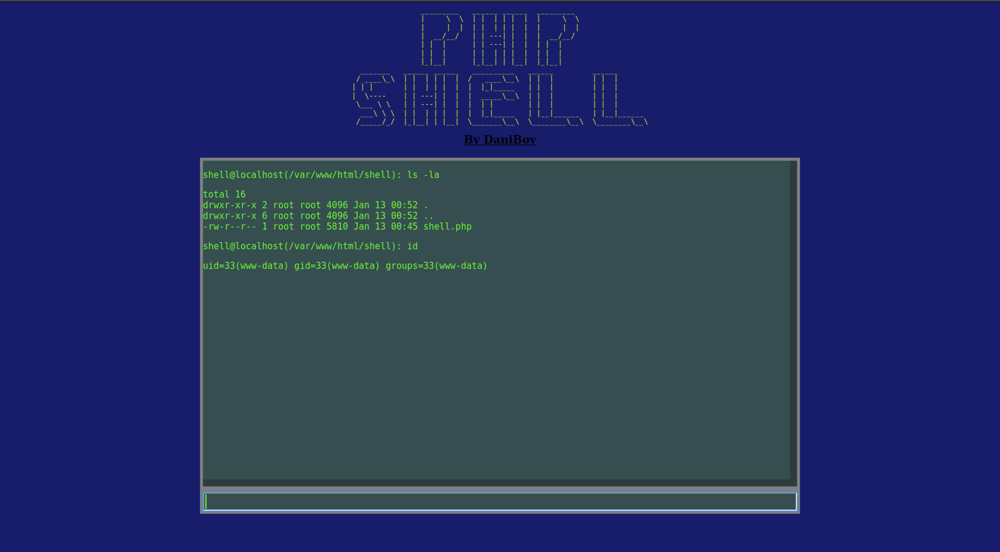

# Php-Shell

## Features

* cd (feature for locomotion between directories)
* suExec (Feature that leverages the "su" command to execute commands)

## image

### inspired by: https://github.com/flozz/p0wny-shell
